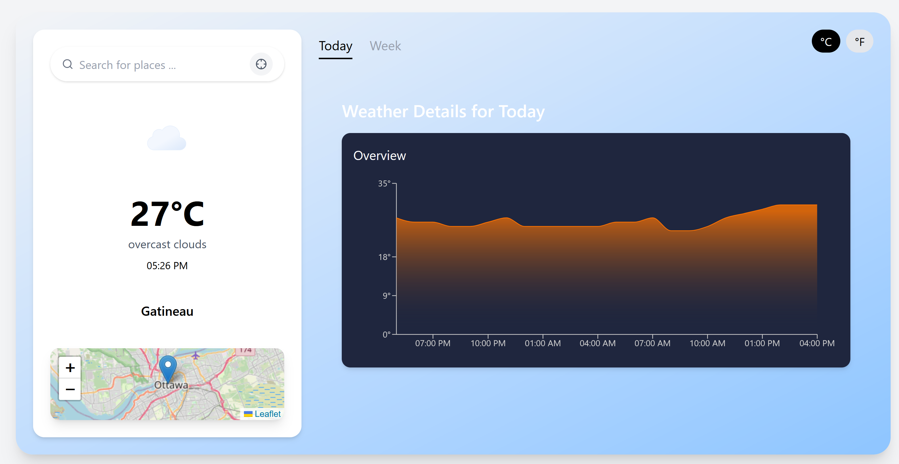
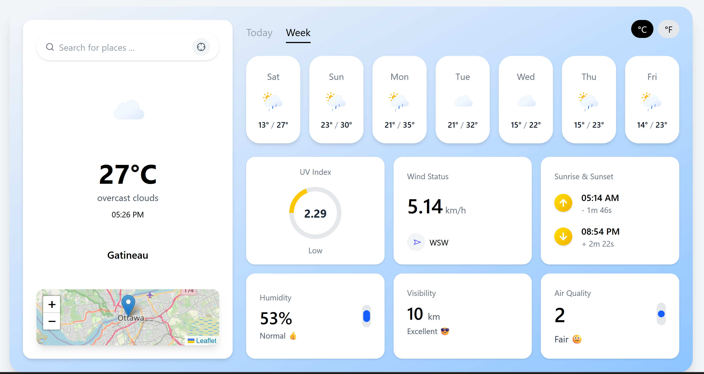

# 🌦️ React Weather App

A modern weather dashboard built with **React.js** and **Tailwind CSS** using the **OpenWeather One Call API 3.0** and **TimeZoneDB**.

## 🔧 Features

- 🔍 Search by city name
- 🌤️ Display current weather conditions
- 📊 Hourly temperature chart for current day
- 📅 7-day forecast with dynamic cards
- 🕒 Accurate local time based on city timezone
- 🌅 Sunrise & sunset times
- 🌬️ Wind status, humidity, visibility, UV index
- 🖼️ Dynamic weather icons based on conditions
- 🌗 Toggle between °C and °F
- 🔒 .env protected API keys

## 🖼️ UI Preview

### Today View


### Week View


## 📦 Technologies Used

- React.js
- Tailwind CSS
- Axios
- Vite
- Recharts (for hourly chart)
- OpenWeather One Call 3.0 API
- TimeZoneDB API

## 🛡️ .env Configuration

Create a `.env` file in your root project directory and add:

```env
VITE_OPENWEATHER_API_KEY=your_api_key_here
VITE_TIMEZONEDB_API_KEY=your_timezone_api_key_here


🚀 Upcoming Features
Auto-detect user location

Dark mode / Light mode toggle

Additional weather parameters (e.g., air quality breakdown)

Accessibility enhancements

📄 License
MIT — free to use and modify.
Made with ❤️ by Kawther.


---

✅ You can now copy this updated version directly into your `README.md`.

Let me know if you want to add sections like installation steps or contributor guidelines!
