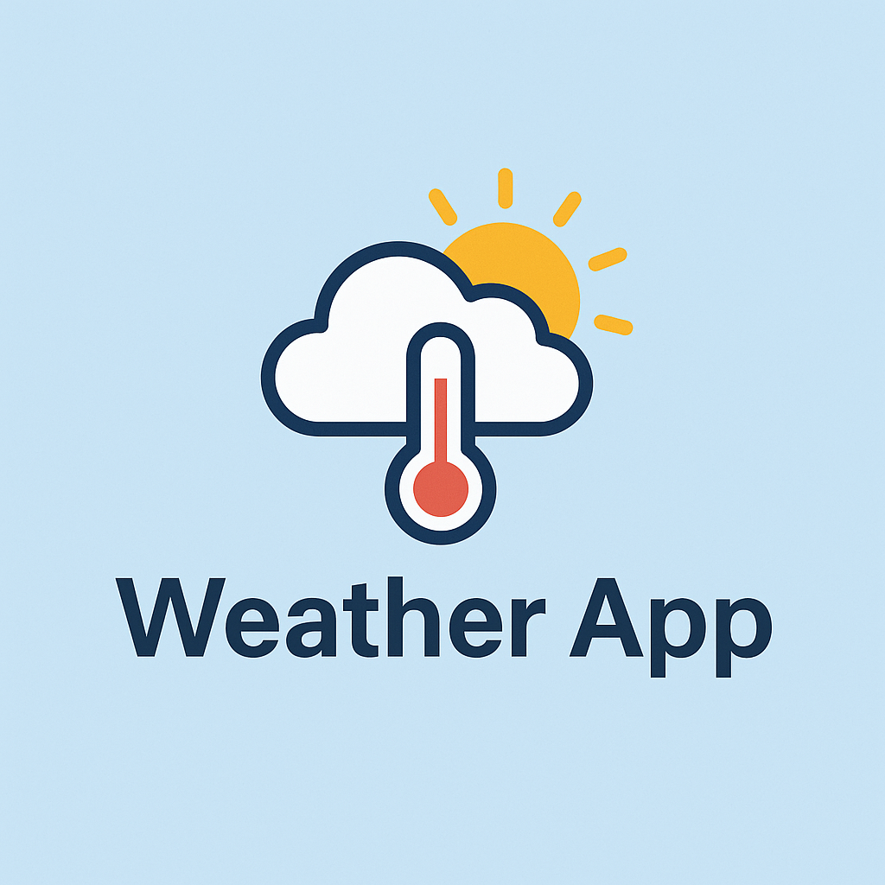

# 🌦️ React Weather App

A modern weather dashboard built with **React.js** and **Tailwind CSS** using the **OpenWeather One Call API 3.0** and **TimeZoneDB**.

## 🔧 Features

- 🔍 Search by city name
- 🌤️ Display current weather conditions
- 📅 7-day forecast view
- 🕒 Accurate time based on city timezone
- 🌅 Sunrise & sunset times
- 🌬️ Wind status, humidity, visibility, and more
- 🖼️ Dynamic weather icons based on conditions
- 🔒 .env protected API keys

## 📦 Technologies Used

- React.js
- Tailwind CSS
- Axios
- Vite
- OpenWeather One Call 3.0 API
- TimeZoneDB API

## 🛡️ .env Configuration

Create a `.env` file in your `client/` directory:

```env
VITE_OPENWEATHER_API_KEY=your_api_key_here
VITE_TIMEZONEDB_API_KEY=your_timezone_api_key_here
## 🌤️ Weather Dashboard



A modern weather application built with React and Vite. It allows users to search for a city and view the current weather, 7-day forecast, and key weather highlights like humidity, UV index, and wind speed.

---

### 🔍 Features

- City search
- Real-time current weather
- 7-day forecast
- Weather highlights: UV index, humidity, visibility, wind
- Auto time zone adjustment based on city
- Custom weather icons
- Powered by **OpenWeather One Call 3.0 API**

---

### 🔒 Security

All API keys are stored in an `.env` file and ignored by Git using `.gitignore`.

---

### 🚀 Upcoming Features

- Auto-detect user location
- Dark mode / Light mode toggle
- Hourly weather graphs
- Better accessibility support


📄 License
MIT — free to use and modify.
Made with ❤️ by Kawther.